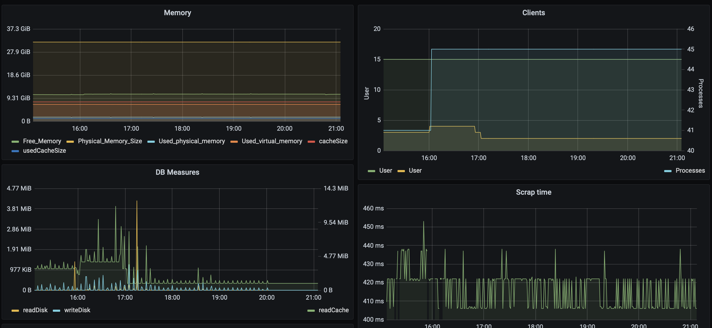
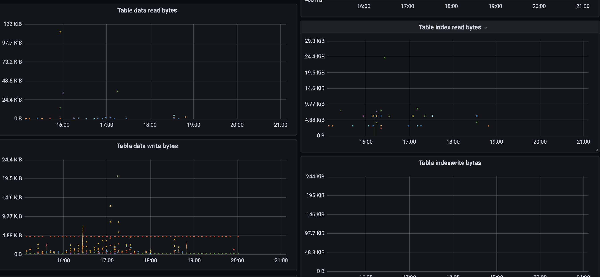

# Prometheus 4D Exporter


### Installation

###### Recommended way

Copy to 4D's component folder (compile/build upfront for production usage). 4D v19 required. This launches an additional web server on a separated port, not sharing the main web server, only for Prometheus access, keeping the main server more confidential/secure.

In your On Server Startup method call:

```
		ARRAY TEXT($tTxt_Components; 0)
		COMPONENT LIST($tTxt_Components)
		If (Find in array($tTxt_Components; "Prometheus_4D_Exporter")>0)
			$para:=New object("HTTPPort"; 9828; "user"; "myusername"; "pass"; "mypassword")
			EXECUTE METHOD("Prometheus_Start"; *; $para)
		End if 
	End if 
```

Change HTTPPort (default 9828), HTTPSPort (default 9843), username, password as needed. If you do not pass user/pass the server runs without authentication. 

You can disable the exporter at any time by removing it from the component folder and restart 4D.

###### Alternative installation for 4D v19

If you want to share the main web server, add to your onWebConnection database method:

```
If ($1="/Metrics")
	C_BLOB:C604($blobin; $blobout)
	DOCUMENT TO BLOB:C525(Get 4D folder:C485(Current resources folder:K5:16)+"metrics.shtml"; $blobin)
	PROCESS 4D TAGS:C816($blobin; $blobout)
	WEB SEND BLOB:C654($blobout; "text/plain")
End if 
```

Modify /Metrics to another URL if required (which needs to adapt prometheus.yml as well, by example:  metrics_path: /my4Dmetrics )

Copy the file metrics.shtml from the resource folder of the component into the resource folder of your main application.

###### Usage with 4D v18

For 4D v18 (which does not support multiple web servers) follow the alternative installation (share the main web server). You also need to rewrite metrics.shtml, as v18 does not support the 4DEACH Tag. You need to rewrite it to 4DFOR loops. 

Documenation: https://doc.4d.com/4Dv18/4D/18.4/4D-Transformation-Tags.300-5233786.en.html


### Prometheus Setup

Add to your prometheus.yml file a job such as:

```
  - job_name: 'My4DDatabase'
    scrape_interval:     60s
    static_configs:
    - targets: ['192.168.0.34:9828']	
```

The metrics are calculated for 60 seconds. If you want to change the interval, the used code needs to be changed as well.

### Metrics

The metrics starts all with "FourD_". They return metrics about total number of connected clients, running processes, memory usage details, detailed information about database usage (read from disk, write to disk, read from Memory in total and per table) and for queries the count and time per query operation


### Grafana Dashbaord	

An example dashboard is included in the "Grafana" [folder](Grafana/4D-1622574690034.json).

The dashboard shows memory usage (free, virtual, cache, etc), Client and process usage, total database measures (read and write to disk and read from cache for all database operations) and scrap time. The scrap time is useful to see if the total system behave slower than normal.



Followed by read from disk per table, focused on records on the left, on disk on the right, below the same for writing to disk:



Followed by reading from cache, left records per table, right index per table. Move the mouse over a line (or dot) to see a legend (details about each table)

Below analyze per query. On the right total execution counted, on the left total time need per queries type


